# Clear Privacy Statements Initiative

by Antonio Anzivino {djechelon}@zighinetto.org, Master in Computer Engineering, Software Architect

# Abstract

This work addresses the "Informative Chiare" (Clear <*Privacy*> Statements) initiative by the [Italian Data Protection Board (GPDP)][1], which aims at simplifying the web privacy statements by Service Provider for an easier understanding by consumers.
The key concept is that modern privacy statement, required by [EU 679/2016 "GDPR" regulation][2] is too often long and hard to understand by final consumers.

The main role of the GDPR is not, as often misinterpreted, to pose hard limits on collection and utilization of consumer's personal data, but rather to increase conscioiusness, self-responsibility, educated choices and confidence in data processing, as well as increase value in commercial transactions.

Unfortunately, mandatory privacy policies written in *boilerplate legalese* started to spread along major and (especially) minor websites. In a [2020 study by Varonis Security][3], it can take up to 27 minutes to fully read a complex privacy statement of one of the 10 most popular web services, and privacy statements are complex enough to require a high level of education to be fully understood.

This is the reason why the GPDP is looking into innovative ways to simplify the privacy statement and their understanding from consumers, as well as helping them making educated choices on data collection agreements, with the use of **graphical icons**.

In this work, we are going to illustrate a possible utilization of open source icons in privacy statements to get an immediate and clearer idea of the requirements of Articles 13 and 14 of the GDPR. This dissertation will cover Font Awesome and Material Icons in particular. While we recommend the utilization of certain icons from these two proposed project, implementors are free to choose a different icon pack or design their own icons, but they are encouraged to use similar design to those proposed, or that the new design clearly represents the key concepts involved.

The icons and their utilization in a privacy statement must be combined to, and cannot replace, a proper fully fledged *legalese* privacy statement written by a competent lawyer. For the purpose of the entire work, however, the *simplified* privacy statement using icons must reflect the real data processing policies of the company displaying it.

For the web and mobile world, we will be proposing to use the **web font** technology, which enables using simple glyphs of the Unicode *alphabet* to universally display a gliph associated with semantics.

## Statement about Sponsorship and Conflict of Interest

The author declares that this work received no approval, review, nor any kind of sponsorship, gift, monetary solicitation from any third party in exchange of an endorsement.

The author endorses the utilization of the proposed open source libraries only after their richness, quality and free availability.

## Requirements for graphical icons in privacy statements

Since `an icon is worth 1000 words`, we must define the technical and graphical requirements for icons to be properly displayed and understood by final users.

### Open source

The first requirement is the open availability, namely no copyright constraints over the chosen icons. Since icons are going to become the de-facto standard for privacy statements, we want to encourage the largest number of companies to adopt them without the need to pay royalty fees or negotiate agreements with the original authors. This is the main reason why the author chose [Font Awesome][4] (CC BY 4.0, MIT License), [Material Design Icons][5] (Apache 2.0), [The Noun Project][6] (Public Domain, Attribution, Royalty-Free).

### Unlimited scaling

Another requirement is size scaling. Icons must fit multiple display format, including web pages on high-resolutions desktop screens, and going to small mobile screens. The icons must be simple enough, in their design, to fit multiple scales while keeping their expressiveness. For this particular purpose, icons are often designed to carry the least possible amount of detail (e.g. shadows, decorations, shape of eye, nose when indicating a person, etc.), and they are originally made in vector format. A vector format, in short, is a technical format that, compared to the *raster* format typical of JPEG photos, describes an image by its grounding elements - such as lines and polygons - in some sort of "instructions to draw the image at **any** scale", while the raster format only provides a matrix of pixels with different colour tones without any relationship each other. The most popular open vector format is SVG ([Scalable Vector Format][7] by W3C)

### Unopinionated and immediate

The pictograms in use in a privacy statement must well-reflect popular and de-facto concept standards to be immediately understood by final readers. They must be unopionionated and not require a driver's school class. One popular icon we can use as an example is the **Map pin icon** which ultimately identifies geolocation. It was originally designed by artist [Jens Eilstrup Rasmussen][8] and today, with some trimming to the original shape, has become the de facto synonym of "geolocation". A decade ago, this icon alone would mean nothing to a first-time reader. The choice of the icons must reflect popular culture and may change in the future.

### Inclusiveness

In a modern multicultural society, icons must also be *representative* and *inclusive*, must not provide any kind of discrimination between social minorities and must be neutral versus gender, politics, and religion. We must choose our proposed icon set in a way that is the most neutral and inclusive, in order to avoid members of designated social groups to feel discriminated, or socially criminalized. We must choose icons to represent **people**, **human beings**, not *males* or *females*. And if an icon really has to represent concepts related to colour skin, religion, health and disability status, or sexual orientation, it must do that in the most objective, neutral and tactful way.

Note that, within the scope of this work, inclusiveness is referred only to the chosen icon design, not to the ultimate data processing which is up to the online Service Provider.

### Accessibility

Pictograms should also be very well *accessible* to impaired users. It is not just a matter of not discriminating people from their skin colour of the kind of their prayers (or whether they believe in divinities), but also a matter of helping people with sight disabilities to understand the icon when it is not possible for them to see it. For printed documentation, there is no braille equivalent of the pictograms. However, the privacy statements should still be well concise to help people understand them in braille too. For electronic statements, especially in HTML pages, screen readers can use descriptive tag to provide a vocal explanation of the icon. Each icon set has its own accessibility advices. This is the main reason we are focusing on glyphed web fonts.

### Non-negative

The concept carried by the icon should never be *negative*. It must be either neutral or positive. This requirement is not a legal requirement but helps social acceptance of the statement. Compare expressions such as "*we track your activity*" to "*we provide innovative and customized content based on your activity*", or recall that the fingerprints are often associated with crime and law enforcement.

No one wants that their customers feel observed, monitored, discriminated. And no user wants their data to be used against them.

### Black and white glyphs

Pictograms should also be plain colour-less glyphs, i.e. not require particular style or background for proper displaying, thus not rely on shapes of different colours to display a concept. This is a key aspect from two main point of views: first, we have already illustrated that pictograms must be fully scalable, and that adding details increases the icon's complexity; secondarily, icons should be easily integrated into any page colour layout, particularly including dark mode, high contrast mode and any possible *fancy* colour layout chosen by the designer. For this purpose, Font Awesome and Material Icons provide a very useful integration called *web fonts*. The pictogram is embedded into the page as text leveraging the vector format of font typings. Each font code corresponds to a *glyph* in the library, and can have a single colour equal to the paragraph's font colour.

# Categories of personal data

The possible categories of personal data that an online Service Provider may collect and process from an individual is unbounded. In this work, we will cover the most frequent and relevant categories of personal data that can be seen on popular online privacy statements.

In this chapter, we will use `preformatted` text to indicate string literals. By conventions, icon names that begin with `fa-` (e.g. `fa-user`) belong to FontAwesome 5, while those that begin with `mat-` (e.g. `mat-account-box`) belong to Material Design. We will try to provide more than one choice for the icon to use, as we deem different icons to well represent the same concept. The final choice should be up to the implementor.

For stylistic reason, we *recommend* implementors to make a consistent choice of icons among only one set/library.

We will embed some icon designs in this document, however we encourage the reader to look for the icon literals on the official websites of Font Awesome and Material Design for full-size visualization and source code.

### Technical and device information

This category includes generic technical information that is normally required for online network operation. This **mainly** includes the IP address of the client machine that is interacting with the online service, but is not limited to it and may also include the web browser version, screen resolution, language capabilities etc.

For this category of data, we propose to utilize a pictogram of a computer, including `fa-laptop`, `mat-laptop`, or a handheld device, e.g. `fa-mobile` or `mat-smartphone`. The pictograms either display a computer of the size of a portable (laptop) computer, or a full-screen handheld device like a smartphone, the most used mobile electronic device today.

These icons are very well combined with a short statement like

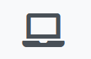

> We use technical information obtained from your electronic device, including network address (IP address), name and version of the web browser, screen resolution, operating system version, language preferences, as well as the presence of accessibility software on your device. These necessary information are automatically transmitted and cannot be opted out for

### Cookies

While closely related to technical information, web cookies are a notable category of personal data covered by the [EU Cookie Directive 2002/58/EC][9], as they require a dedicated privacy statement.
  
A short notice of the cookie usage in a privacy policy is advisable. We recommend to use icons such as `fa-cookie-bite` and `fa-cookie`. Unfortunately, Material Design by Google does not provide a unique and unopinionated pictogram for cookies, which can be found online in several copyrighted icon packs. The preference for the "-bite" version of the cookie is due to its utilization in several privacy statements the author has seen historically.

Alternative representation of an electronic cookie are pictograms of pairs of biscuits (cookies...), or cookie-jars, as soon as the content of the jar is clearly visible. For larger screen resolutions, a pictogram of a glass jar with the word "cookies" on a label is sufficient and powerful for the purpose, despite violates the recommendation of "fits-any-scale" icons.

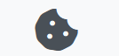

### User's biographical information

With *biographical*, we normally mean information that is used to identify a person in the *real world*, as displayed on a National Identification Card or a passport. Note that not all services do require full biographical information to provide a service.

**Example: collecting user's full biographical information**

On an e-commerce or travel website, it is normally mandatory to provide first and family name, as well as home address and often date of birth too. Information that appears on identity documents should be very well represented by a pictogram that immediately recalls an identity card, passport card or similar. A photo-badge, often used in work environments and without legal value, is a valid pictogram too in this context because of its expressive power.

Proposed icons are `fa-id-card`, `mat-contact`, `mat-switch_account`. In particular, `fa-id-card` clearly represents an identification document **with** biographical details along with a photo. The key is to tell the user that the online service is gathering information that directly identify the individual

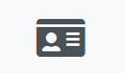

**Example: keeping user discreet**

In services such as social media, discussion boards, etc. where the real identity of the user is not legally required (and it is likely that users do not prefer to use it), often users are identified by email address and/or cell phone number. The use of unique cell phone number is often used not only for future logins, but also to prevent abuse by spam robots, given the effort and costs needed to obtain multiple numbers. It is important remind that email addresses and phone numbers are still Personally-Identifiable-Information (PII) under the scope of the GDPR, as it is extremely easy to cross-reference them with archives of known individuals.

While it is necessary to clearly state that the online service collects this kind of PII, it could be advisable to use a different pictogram for this kind of pseudonym identification.

The "at" `@` glyph is the unopinionated symbol of email. `fa-at` and `mat-alternate_email` are perfect candidates, as well as a pictogram displaying "*a mail envelope with a `@` glyph on it*". For services using only the phone number, the following ideas apply. We want to represent a phone number without reusing the *mobile device* icon. Icons that display a *vintage phone*, like `fa-phone-rotary`, or even more explicitly depict *SMS* wording like `fa-sms`, are possible choices

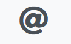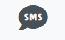

## Sensitive data

GDPR article 9 defines *special categories* of personal data that may reveal information about 

> racial or ethnic origin, political opinions, religious or philosophical beliefs, or trade union membership, and the processing of genetic data, biometric data for the purpose of uniquely identifying a natural person, data concerning health or data concerning a natural person's sex life or sexual orientation

It is worth to note that, while it is generally prohibited to process this kind of information, there are circumstances in which this processing is allowed. Just think about that all medical labs are required to electronically process the person's health status.

### Racial and ethnical origin

This category of information is particularly sensitive to deal with, especially in the context of choosing a proper form to represent the concept in a way that is neutral and respectful to minorities. It is worth to point that while the concept of *human race* is widely debated, the *ethnical origin* is not limited to the skin colour. Neverthless, the skin colour is the most evident and representative factor of *ethnicity*, thus the author suggests to leverage it for a glyph icon simple and powerful enough to explain this concept.

For this purpose, the author looked for appropriate icons in the catalog of Font Awesome and Material Design, without success. So, the author proposes a new design and is going to reference another open source design that could be integrated into a design library.

The glyph should display two human shapes (e.g. `fa-user` or `mat-person`), one with just borders, to represent a *white*, and another in solid form, to represent a *black*. The icon can be designed with some variations. For example, there could be a single *person* half black and half white.

A suggested design is displayed in the figure below

[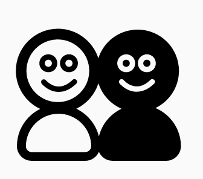][10]

The design could be improved by omitting the smile of the subjects.

### Political opinions and activity

This category includes political beliefs, voting orientation and also (according to previous Italian regulation) the belonging of the data subject to a trade or workers' union.

In the context of the European Union, where democratic monarchies (e.g. the Kingdoms of Spain, Denmark, etc.) co-exist with republics (e.g. the Republics of Italy, France, Estonia, Czechia, etc.), the icon that could best represent the concept of political beliefs should be associated to contexts of *Democracy* and *Parliament House*.

Note that the author recommends **not** to use certain icons that could be too specific or confusing with other concepts. For example, the `fa-democrat` should never be used as it is tightly bound to the concept of the US Democrat Party and would be found *discriminating* by supporters of the oppositions. Icons that recall **Communism** should also never be associated with trade unions for sake of neutrality. Icons that depict a *Parliament House* under shapes similar to *US Congress*, *Roman Pantheon* or *Greek Acropolis*, displaying what is interpreted as an "*official building*", are likely to be confused with banks and universities because these symbols are widely used in literature. For the same reason, *Courthouse hammers* should not be used as they recall the concept of **law** more than politics.

Considering the icons proposed by Font Awesome and Material Design, the best conceptual match would be a **voting ballot**, in particular `mat-ballot` and `fa-ballot`, `fa-ballot-check`, `fa-box-ballot`. The author has a number of doubts whether those ballots can be easily understood by a reader with normal level of education, without reading the code behind. In fact, there is an excessive similarity between the ballot box design and a printer. It is hard to tell the difference between a Font Awesome's ballot card and a checklist.

The ideal design of a Parliament Icon should display an **emicycle**. One particular design is distributed with free license

[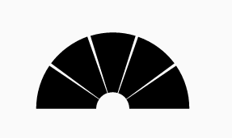][11]

The design could be improved, as the Italian Parliament does, by highlighting the arcs on the emicycle that represent the seating rows. This way, the design could uniquely define politics.

### Genetic data

For this kind of information, only Font Awesome provides unopinionated design that can be used to accompany a privacy statement. It is `fa-dna` and represents the DNA elicoid.

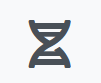

### Biometric data (for identification purposes)

The world of biometrics is vast enough to cover different categories. However, the most effective and unopinionated way to represent biometrics has been, and is still, the concept of **fingerprint**. It is represented by `fa-fingerprint` and `mat-fingerprint`.

It is worth to note that the concept of fingerprints could cause a negative reaction from the audience, especially if biometric samples are not fingerprints. Historically, fingerprints are often associated with crime and law enforcement. Consumers do not like to be treated like potential criminals.

It is then advisable, when the biometric information collected from the user is not those of the fingerprints, to use a different design. In particular, face recognition is getting more and more popular because of social acceptance. In such context, an icon dedicated to face recognition (or in general video recognition) should be more advisable.

In general, the design of a face recognition is made of a human face, with basic features, covered with a series of points and lines, depicting either the concept of *(neural) network*, or just the fact that any face recognition algorithm compares the size and distance of a relatively large number of face features.

The following Creative Commons design could be used as starting point

[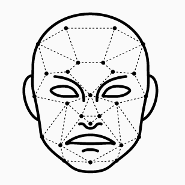][12]

However, this particular design might look *aggressive* in its expression and should be dramatically improved. Still, the same source *The Noun Project* provides a large number of further designs for face recognition. Other significant samples include a human face that is either combined with a checkmark, or surrounded by a *bounding box*. A crosshair is not recommended for use as it may recall concepts of *weaponry* and *targeting*.

### Health status

The best icons, in this case, are provided by Font Awesome. `fa-stethoscope` and `fa-heartbeat` are perfect for the concept of health status. An alternative, especially for sports-related contexts, is made by `fa-run` and `mat-directions_run`.

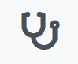

### Sexual life

Despite the name, one of the best and most neutral icons is `fa-transgender` and `mat-transgender`. `fa-venus-mars` is a simple alternative for Font Awesome utilizers. It represents both conventional genders in a perfectly neutral way

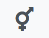

## Non-normative sensitive data

### Geographic location

Geographic location, in short geolocalization, is not accounted as *sensitive* under the GDPR, but its uses and abuses make it particularly sensitive with regards to the ability to identify an individual or invade their personal life. Think to people who often visits jails or drugs recovery centres, and not probably for work.

As said in an earlier paragrah, the universally unopinionated icon to display a geolocation **is** the pin `fa-map-marker`, `mat-location-on`, with plenties of variants.

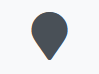

### Financial information

Although not listed in the sensitive data, detailed information about the economic status of an individual is trated sensitive when it might reveal a potential situation of economic suffer. Banks and credit agencies do process this information daily, despite in the EU an organized **credit scoring** system is not enforced such as the one in the US. Still, this kind of information may deserve an appropriate highlight.

An icon such as `fa-money-bill` or `mat-money` is adequate for the purpose.

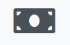

# Companion project

A *companion project* is being made together with this paper in order to show a demo of an icon-based privacy statement.

It is a simple Angular app with an example of a privacy policy that simulates collecting all sorts of information from the user. Of course, the contents of the policy does not represent reality.

> THE APPLICATION IS WORK IN PROGRESS ON https://github.com/Zighinetto/privacy-app-demo

# References

  [1]: https://www.garanteprivacy.it
  [2]: https://eur-lex.europa.eu/legal-content/TXT/?uri=CELEX%3A32016R0679
  [3]: https://www.varonis.com/blog/gdpr-privacy-policy/
  [4]: https://www.fontawesome.com
  [5]: https://www.material.io/resources/icons
  [6]: https://thenounproject.com/
  [7]: https://www.w3.org/TR/SVG11/
  [8]: https://www.moma.org/collection/works/174200
  [9]: https://eur-lex.europa.eu/legal-content/EN/TXT/?uri=CELEX%3A32002L0058
  [10]: https://thenounproject.com/term/ethnicity/88194/
  [11]: https://thenounproject.com/term/european-parliament/582583/
  [12]: https://thenounproject.com/term/face-recognition/1903279
